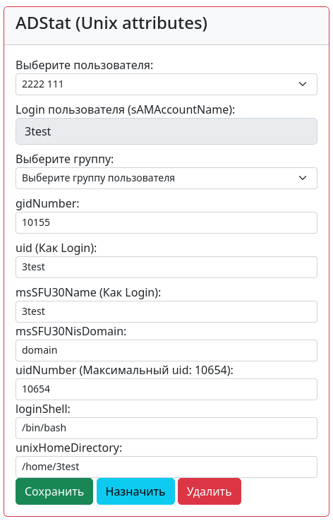

## ADStat.

### Пример отображения в браузере:


## Установка ADStat:
### 1. Скопируйте файл настроек в директорию с проектом Django:
```
cp env-example adstat2/.env
```

### 2. Установите переменные в файле .env:
```
USERNAME='DOMAIN_COM\user'
PASSWORD='Password'
LDAP_SERVER='192.168.1.1'
BASE_DN_ROOT='DC=domain,DC=com'
DOMAIN='domain'
```


### 3. В корневой папке проекта выполните:
```
docker build -t adstat . 
docker run -it --name=adstat -p 8000:8000 --hostname adstat adstat
```


### 4. Проверьте доступность ресурса по адресу http://{you_ip}:8000
