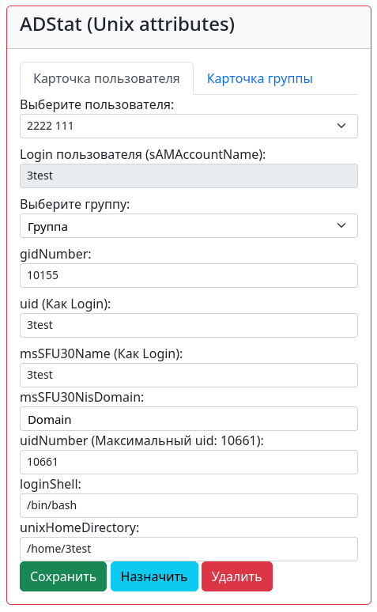
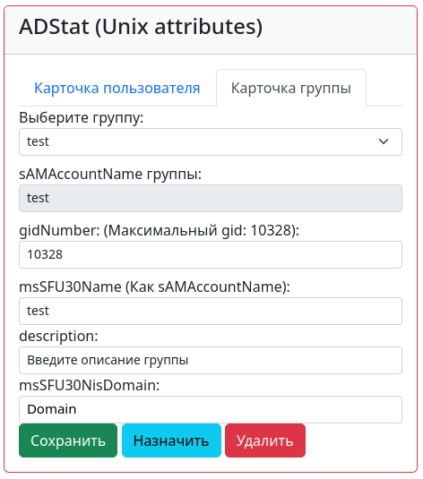

## ADStat.

### Пример отображения в браузере:



## Установка ADStat:
### 1. Скопируйте файл настроек в директорию с проектом Django:
```
cp env-example adstat2/.env
```

### 2. Установите переменные в файле .env:
```
USERNAME='DOMAIN_COM\user'
PASSWORD='Password'
LDAP_SERVER='192.168.1.1'
BASE_DN_ROOT='DC=domain,DC=com'
DOMAIN='domain'
```

### 3. Установи необходимые значения в settings.py:
```
CSRF_TRUSTED_ORIGINS = ['http://localhost:8000', 'http://127.0.0.1:8000',]
```

### 4. (Для Docker)В корневой папке проекта выполните:
```
docker compose build 
docker compose up
```

### 5. Не забудь создать суперпользователя в админке Django
Если используешь docker, то для этого надо зайти в контейнер и сделать это:
```
# docker exec -it adstat /bin/sh
```
Создание суперпользователя в django:
```commandline
./manage.py createsuperuser
```

### 6. Проверьте доступность ресурса по адресу http://{you_ip}:8000


### Запуск тестов, запуск отдельного теста например:
```commandline
./manage.py test 
./manage.py test adunix.tests.test_views.TestIndex
```
